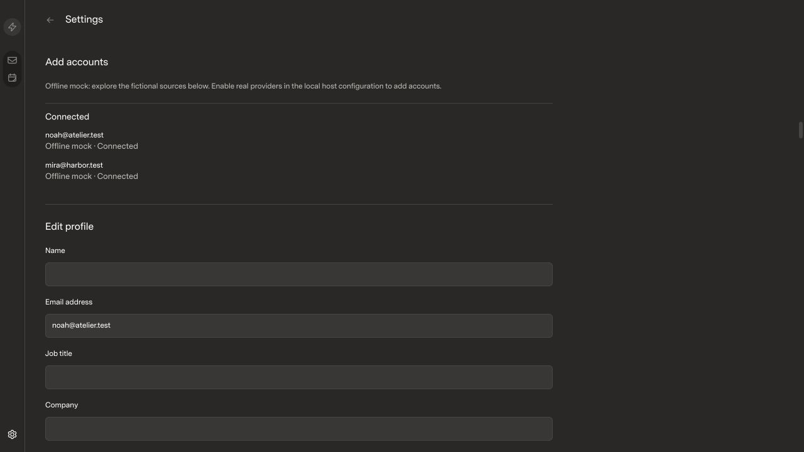

# Outlook access probe in Add Accounts

## Scope

Add a Microsoft work-account access test to Add Accounts. The user supplies their
Entra application and tenant IDs, signs in through Microsoft, and sees separate
results for sign-in, mailbox read, forced token refresh and a second mailbox read.
This prototype does not add a connected mailbox. Tokens stay in host memory and
are discarded at completion or cancellation. Full-client mode checks additional
grants without sending or modifying mail.

- Review base: `59cad311333d82c9a20ebc70d1dc113ebcea6029`.
- Local main, remote main and the installed application release match this base.
- Candidate: pending implementation.
- [x] UIPR.

## Before and after

| Scenario | Before | After |
| --- | --- | --- |
| Add Accounts |  | Pending |

The isolated mock fixture uses Noah Ríos and Mira Chen. It contains no real mail
or account credentials. This is a fictional fixture on the current app revision,
not a screenshot of the user's connected Fastmail account.

Both captures use 1280 × 720, default zoom, Dark theme, Superlocal style,
Comfortable density and normal font size. Baseline assets were built with Bun
1.4.0 and Vite's production build and served at localhost:5192. Baseline asset
identity: `index-CKm0HM1M.js`, `index-kKVWxxy0.css`.

Expected difference: an Outlook test action and a setup/results workflow. Verify
pending, success, consent denial, refresh failure, cancellation, retry and keyboard
behavior. Matching after screenshots and interaction evidence are pending.

## Performance and correctness

Baseline web build passed. Implementation checks are pending: host and SDK
typechecks, SDK/web builds, web tests and API tests with live tests disabled.
Extend existing test files only. Mail reconciliation, caching and rendering are
outside this scope, so large-mailbox performance benchmarks are not applicable.
Live organization consent requires the user's own Entra registration and sign-in.

## Review gate

- [x] Baseline-only branch contains no unrelated unpublished history.
- [ ] Matching after evidence is attached and inspected.
- [x] Published baseline media is approved fictional data.
- [ ] Relevant checks pass.
- [ ] Unexpected UI changes are fixed or approved.
- Reviewer approval: pending; remain draft. No merge or deployment approved.

The pre-existing root lockfile edits remain outside this change.
