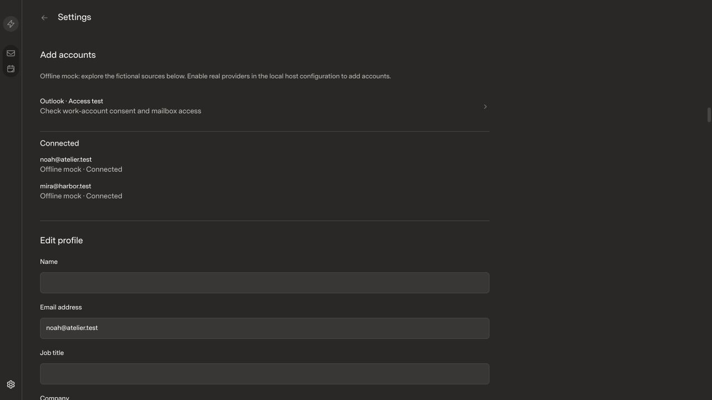
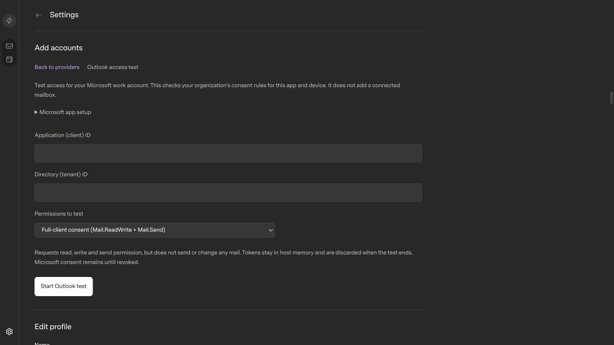
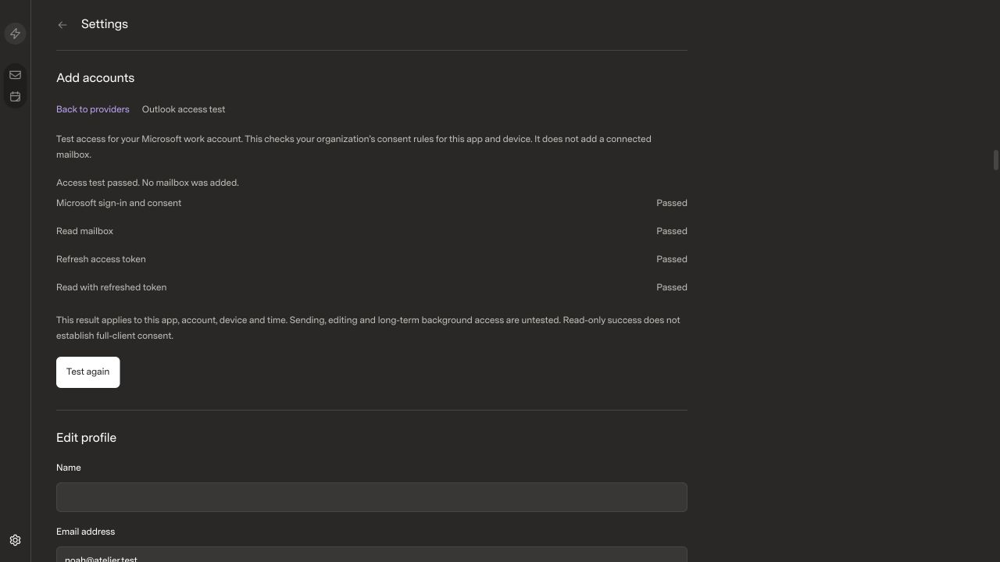
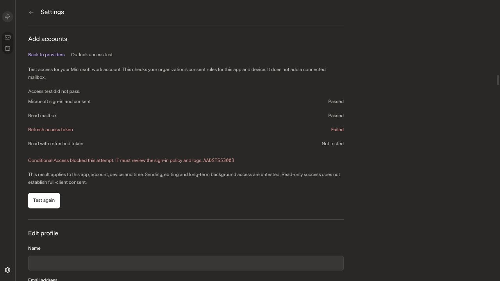
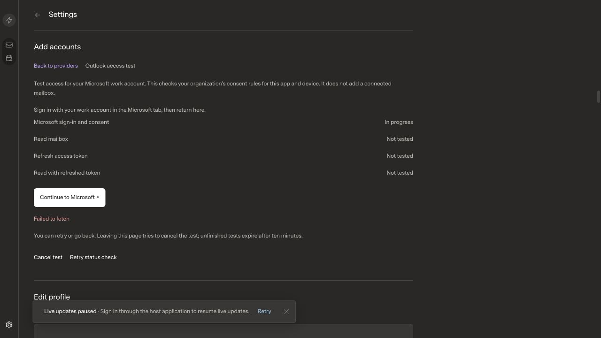
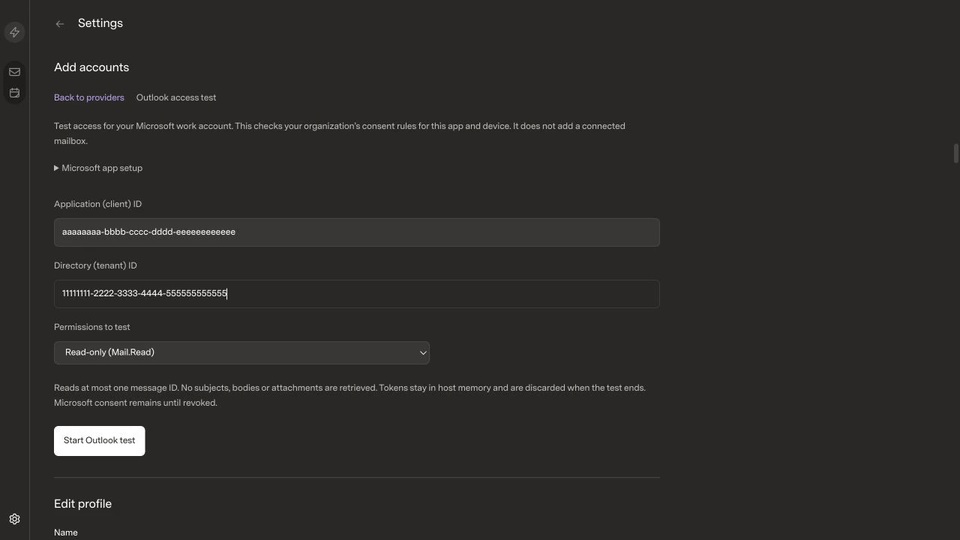
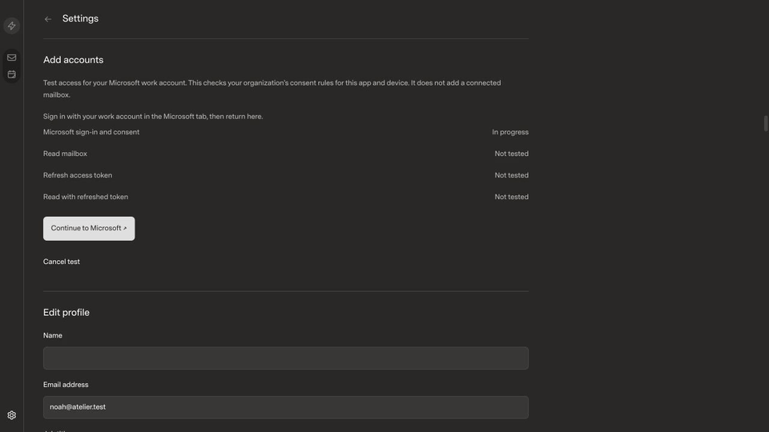
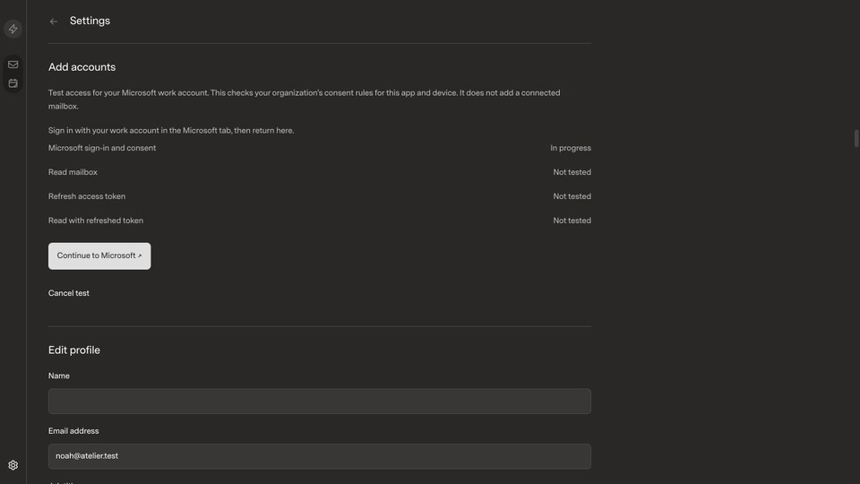

# Outlook access probe in Add Accounts

## Scope

Add Accounts now offers **Outlook · Access test**. Enter your Entra application
and tenant IDs, choose read-only or full-client consent, then sign in through
Microsoft. The result separates sign-in, mailbox read, forced token refresh and
a read with the refreshed token. This does not create a connected mailbox.

The host owns authorization, PKCE, state validation and the memory-only MSAL
cache. Attempts are owner/session scoped, expire after ten minutes and can be
cancelled. Only message IDs are requested; no mail is sent or modified. Browser
responses contain status and safe diagnostics, never tokens or raw upstream
errors. Existing provider connection routes retain their behavior.

- Review base: `59cad311333d82c9a20ebc70d1dc113ebcea6029`.
- Candidate implementation: `e4f679d`.
- Local main, remote main and the installed release still match the review base.
- The optimized candidate preview serves the changed checkout on port 5192.
- [x] UIPR.

## Before and after

| Scenario | Before | After |
| --- | --- | --- |
| Add Accounts |  |  |
| Outlook setup | No Outlook action |  |
| Full-client consent choice | No Outlook action |  |
| Successful test | No Outlook action |  |
| Administrator consent required | No Outlook action |  |
| Refresh blocked after first read | No Outlook action |  |
| Host unavailable | No Outlook action |  |

Interaction recordings: [sign-in preparation](start.mp4), [successful access](success.mp4),
[refresh failure](refresh.mp4), [cancellation](cancel.mp4). These are captures of
the rendered app, inspected as frame sequences. The original videos retain the
1280 × 720 viewport; the GIF copies below are scaled to 960 pixels for review.

All media uses the same isolated fictional Noah Ríos / Mira Chen mock profile,
1280 × 720 viewport, default zoom, Dark theme, Superlocal style, Comfortable
density and normal font size. No real mailbox or organization identifiers were
loaded. This is the current application revision with fictional data, not the
user's live Fastmail profile. Microsoft discovery/token/Graph responses and the
Microsoft consent page were simulated at their boundaries for the recorded
journeys; actual MSAL and authenticated host routes ran. These recordings do not
establish any real organization's permissions.

Checked required-field focus, Tab order, Enter submission/cancellation, retained
IDs on retry, read-only/full-client descriptions, missing/duplicate OAuth state,
callback replay, timeout, cross-owner access, Graph errors, refresh failure and
host-unavailable recovery. Opening the flow keeps its section in view. A host
error exposes retry and back navigation without claiming cancellation succeeded.
The consent link can be reopened until its callback is consumed.

The in-app browser did not expose a tab created through target=_blank, so the
observed sign-in link was opened through a controlled new tab for callback QA.
Native browser handoff remains part of the live sign-in check. A requested narrow
viewport override still reported 1280 pixels; no narrow-width pass is claimed.
The existing UI was followed; the referenced personal-design skill was unavailable.

## Performance and correctness

- Bun 1.4.0, macOS arm64, Codex in-app browser, optimized Vite production builds.
- Base assets: `index-CKm0HM1M.js`, `index-kKVWxxy0.css`.
- Candidate assets observed in the browser: `index-BLffplZC.js`, `index-DcXXsLPj.css`.
- Host and SDK typechecks, SDK build and optimized web build: passed.
- `bun --no-env-file run test:web`: **69 passed**.
- Focused Outlook API checks: **13 passed, 148 assertions**. Includes actual MSAL
  code exchange plus `forceRefresh: true`, both Graph reads, cancellation,
  owner/origin boundaries, callback replay and content-free failures.
- `INBOX_TEST_LIVE=false bun --no-env-file run test:api`: **262 passed, 1 failed**.
  The existing “paused 10000-thread history leaves a signed 32-arrival prefix
  committed and drains the 33rd arrival without rollback starvation” test exceeds
  its existing 5-second timeout and then reports a closed-database error during
  cleanup. The same failure was reproduced on the unchanged review base. No
  timeout, fixture size, assertion or suite requirement was weakened.
- The staged lockfile passed frozen-lockfile validation. Pre-existing bin metadata
  formatting changes are preserved in the working tree and excluded from this PR.
  Semver 6 now has two nested resolutions, so its existing formatting change is
  retained on both entries. A root Node type dependency prevents MSAL's declarations
  from picking up an unrelated, older Node type installation outside the project.
- Candidate JS: 624.36 kB; CSS: 119.40 kB. The pre-existing >500 kB chunk warning
  remains. MSAL is host-only; it is not included in the browser bundle.
- Mail reconciliation, caching, virtualization and message rendering are unchanged;
  large-mailbox interaction benchmarks are not applicable to this access probe.
- Live organization consent, mailbox licensing and long-term background access
  remain unverified. See [setup and limits](../../outlook-access-probe.md).

## Review gate

- [x] Only the intended feature, its tests and fictional evidence are in the branch.
- [x] Matching before/after evidence is attached, inspected and reviewable.
- [x] Published media is approved fictional data; no private mail or credentials.
- [ ] All required regressions pass: the reproduced baseline API failure remains.
- [x] Observed flow navigation/recovery issues were fixed; QA limits are disclosed.
- Reviewer approval: pending. Keep the PR draft. No merge or installation is
  included in the draft publication approval.

The installed app updater follows origin/main and therefore still serves the
baseline release. The standalone candidate preview is available for review; it
has fictional mail and uses the production Microsoft transport after QA.
